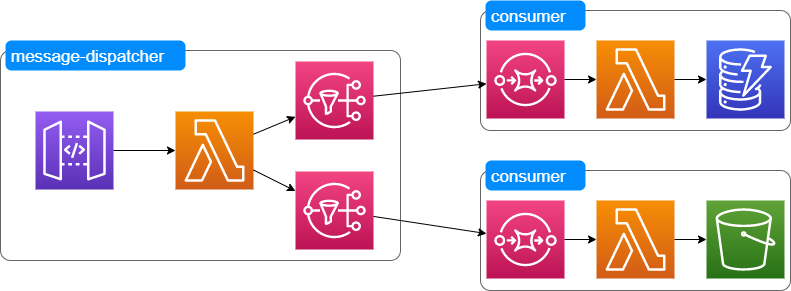

# aws-sls-message-dispatcher

# architecture

# Grafana dashboard

[sls dispatcher and consumer](https://grafana.com/grafana/dashboards/13671/edit)

# serverless framework

`serverless create --template aws-nodejs`

`serverless deploy`

`serverless export-env`

# call API gateway

`curl -X POST https://xxx.execute-api.us-east-1.amazonaws.com/dev/event-receiver --data '{ "text": "Learn Serverless" }'`

